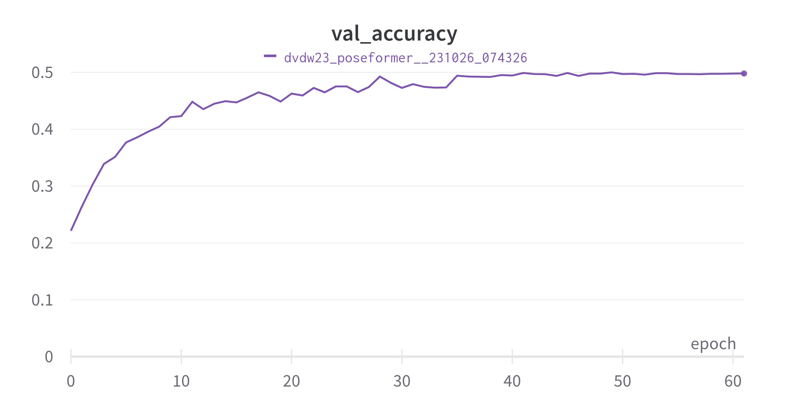

# SLR

This directory contains the code needed to train the sign language recognition model.

The model used at the demo at Dag Van De Wetenschap 2023 was trained by running the following command:

```
python -m train --run_name dvdw23_poseformer --log_dir $LOGDIR --batch_size 128 \
  --learning_rate 3e-4 --num_classes 292 --num_attention_layers 4 --num_attention_heads 8 --d_pose 134 \
  --d_hidden 192 --num_workers 4 --data_dir $DATADIR --gpus 1
```

The data set was collected as part of the [SignON](https://signon-project.eu) project.
The data will become available at the end of 2023.

This model has 2.1M trainable parameters and achieves a validation set accuracy of 50% after training for 50 epochs with
early stopping. The training time to reach this epoch on an NVIDIA GeForce GTX 1080 Ti was 29 minutes.
(Yes, it is exactly 50% after 50 epochs. This is not a typo. See the figure below.)



This pre-trained model can be downloaded from [this link](https://cloud.ilabt.imec.be/index.php/s/RmySLwxaAGWp5ye).

## Conversion to ONNX

You can convert a trained model to ONNX for use in the dictionary search demo with `convert_to_onnx.py`.
This script is self-explanatory.
